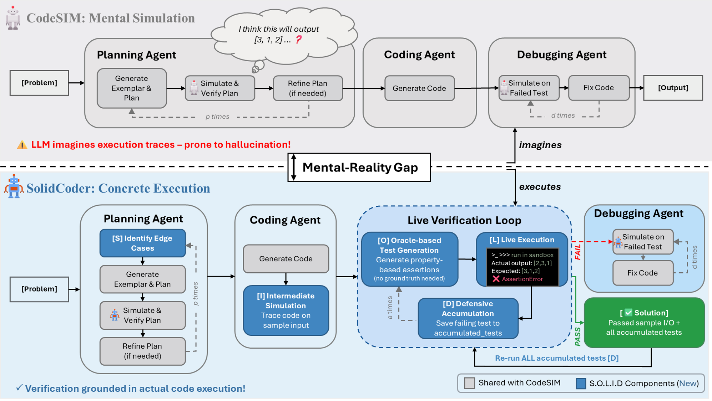
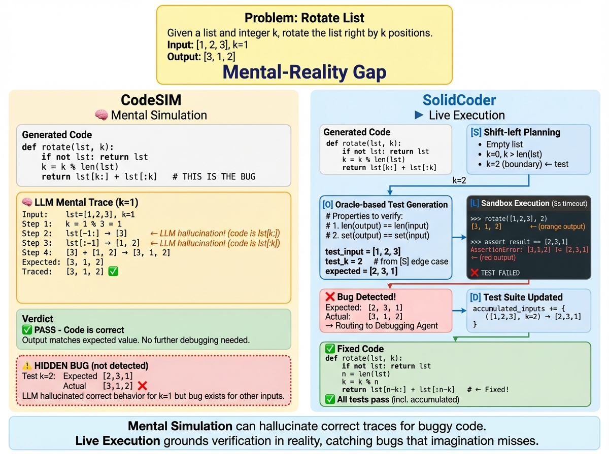

# SolidCoder: Bridging the Mental-Reality Gap in LLM Code Generation through Concrete Execution

> **ARR January 2026 Submission** | Anonymous Repository

## Abstract

Large Language Models (LLMs) have driven remarkable progress in automated code generation. State-of-the-art multi-agent frameworks such as CodeSIM leverage *Mental Simulation*—where the model internally traces code execution—to verify plans and debug errors. However, this approach is fundamentally limited by the **Mental-Reality Gap**: LLMs frequently hallucinate execution traces, believing incorrect code to be correct.

We introduce **SolidCoder**, a framework that bridges this gap by anchoring verification in **Concrete Reality**—actual code execution rather than imagined traces. Our **S.O.L.I.D.** architecture integrates five synergistic components:

| Component | Description |
|:----------|:------------|
| **S**hift-left | Edge-case planning before code generation |
| **O**racle-based | Property assertions without ground-truth outputs |
| **L**ive | Sandboxed code execution for verification |
| **I**ntermediate | Code simulation to catch translation errors |
| **D**efensive | Test accumulation to prevent regression |

## Key Results

SolidCoder consistently outperforms the previous state-of-the-art (CodeSIM) across all models and benchmarks. Results show **pass@1** accuracy (%):

### Main Results (Table 2)

| Model | Benchmark | Direct | CoT | Self-Plan | Analogical | MapCoder | CodeSIM | **SolidCoder** |
|:------|:----------|-------:|----:|----------:|-----------:|---------:|--------:|---------------:|
| **GPT-4o** | HumanEval | 90.2 | 90.9 | 89.0 | 88.4 | 90.2 | 95.1 | **95.7** |
| | CodeContests | 42.4 | 44.2 | 49.1 | 30.3 | 69.1 | 72.7 | **77.0** |
| | APPS | 10.7 | 17.3 | 14.7 | 14.0 | 20.7 | 23.3 | **26.7** |
| **GPT-OSS-120B** | HumanEval | 69.5 | 96.3 | 90.8 | 89.0 | 61.0 | 98.2 | **98.2** |
| | CodeContests | 75.8 | 75.2 | 75.2 | 75.2 | 44.8 | 87.9 | **92.1** |
| | APPS | 35.3 | 32.7 | 34.7 | 30.7 | 24.0 | 39.3 | **40.7** |
| **Grok-4.1-Fast** | HumanEval | 88.4 | 96.9 | 96.9 | 95.7 | 95.7 | 97.6 | **97.6** |
| | CodeContests | 79.4 | 85.4 | 81.2 | 77.0 | 83.6 | 95.2 | **98.2** |
| | APPS | 37.3 | 34.7 | 37.3 | 36.0 | 33.3 | 41.3 | **42.0** |

### Summary

| Benchmark | Avg. CodeSIM | Avg. SolidCoder | Improvement |
|:----------|-------------:|----------------:|------------:|
| HumanEval | 97.0% | **97.2%** | +0.2%p |
| CodeContests | 85.3% | **89.1%** | +3.8%p |
| APPS | 34.6% | **36.5%** | +1.9%p |

The largest gains appear on **CodeContests**—where mental simulation begins to fail but problems remain tractable for execution-grounded verification. Notably, Grok-4.1-Fast with SolidCoder reaches **98.2%** on CodeContests, approaching ceiling performance.

## Architecture Overview



*Figure 1: Comparison between CodeSIM (mental simulation) and SolidCoder (concrete execution). Gray boxes are shared with CodeSIM; blue boxes are S.O.L.I.D. components introduced by SolidCoder.*

### Mental-Reality Gap

The core insight of SolidCoder is that LLMs *hallucinate* execution traces during mental simulation:

| Approach | Verification Method | Limitation |
|:---------|:-------------------|:-----------|
| CodeSIM | Mental Simulation ("imagines") | Hallucinates correct behavior for buggy code |
| **SolidCoder** | Live Execution ("executes") | Grounds verification in runtime reality |



*Figure 2: Concrete example demonstrating the Mental-Reality Gap. **Left (CodeSIM):** Mental simulation hallucinates correct behavior for buggy code, incorrectly validating a flawed solution. **Right (SolidCoder):** Live execution catches the bug through concrete runtime feedback, enabling proper debugging and test accumulation. This illustrates how execution-grounded verification detects errors that mental simulation misses.*

## Installation

### Prerequisites

- Python 3.10+
- Docker (for ExecEval sandbox, required for APPS & CodeContests)

### Setup

```bash
# Clone repository
git clone https://github.com/Anonymous-ARR-Submissions/SolidCoder.git
cd SolidCoder

# Create virtual environment
python -m venv venv
source venv/bin/activate  # Linux/Mac
# or: venv\Scripts\activate  # Windows

# Install dependencies
pip install -r requirements.txt

# Set up environment variables
cp .env.example .env
# Edit .env with your API keys
```

### ExecEval Setup (Required for APPS & CodeContests)

```bash
# Pull and run ExecEval container
docker pull ntunlp/execeval
docker run -d -p 5000:5000 --name execeval ntunlp/execeval

# Verify
curl http://127.0.0.1:5000/api/all_runtimes
```

## Usage

### Quick Start: Run SolidCoder

```bash
# Set API key
export OPENROUTER_API_KEY='your-api-key'

# Run SolidCoder with all S.O.L.I.D. components
PYTHONPATH=./src python src/main.py \
    --dataset HumanEval \
    --strategy SolidCoder \
    --model openai/gpt-4o-2024-08-06 \
    --model_provider OpenRouter \
    --enable_shift_left \
    --enable_oracle_assert \
    --enable_live_verify \
    --enable_inter_sim \
    --enable_defensive_test \
    --temperature 0 \
    --verbose 1
```

### S.O.L.I.D. Component Flags

Each component can be individually enabled/disabled for ablation studies:

| Flag | Component | Description |
|:-----|:----------|:------------|
| `--enable_shift_left` | **[S]** | Edge-case identification before planning |
| `--enable_oracle_assert` | **[O]** | Property-based test generation |
| `--enable_live_verify` | **[L]** | Sandboxed code execution |
| `--enable_inter_sim` | **[I]** | Intermediate code simulation |
| `--enable_defensive_test` | **[D]** | Failing test accumulation |

### Available Options

| Option | Values | Description |
|:-------|:-------|:------------|
| `--dataset` | `HumanEval`, `CC`, `APPS` | Benchmark dataset |
| `--strategy` | `Direct`, `CoT`, `SelfPlanning`, `Analogical`, `MapCoder`, `CodeSIM`, `SolidCoder` | Prompting strategy |
| `--model` | `openai/gpt-4o-2024-08-06`, `openai/gpt-oss-120b`, `x-ai/grok-4.1-fast` | Model name (OpenRouter format) |
| `--model_provider` | `OpenAI`, `OpenRouter`, `Anthropic`, `Gemini`, `vLLM` | API provider |
| `--temperature` | `0` (default) | Sampling temperature |
| `--verbose` | `0`, `1`, `2` | Logging verbosity (2 = full trace) |
| `--store_log_in_file` | `yes`, `no` | Save detailed logs |
| `--cont` | `yes`, `no` | Resume from existing results |

### API Configuration

```bash
# OpenRouter (Recommended - supports all models)
export OPENROUTER_API_KEY='your-api-key'

# OpenAI
export OPENAI_API_KEY='your-api-key'

# Anthropic
export ANTHROPIC_API_KEY='your-api-key'
```

## Datasets

| Dataset | Problems | Difficulty | ExecEval Required |
|:--------|:--------:|:----------:|:-----------------:|
| HumanEval | 164 | Easy | No |
| CodeContests (CC) | 165 | Medium | Yes |
| APPS | 150 | Hard | Yes |

## Experiment Reproduction

### Models Used in Paper

| Model | Description | OpenRouter ID |
|:------|:------------|:--------------|
| GPT-4o | Primary baseline (comparison with CodeSIM) | `openai/gpt-4o-2024-08-06` |
| GPT-OSS-120B | Open-source GPT, RL post-trained | `openai/gpt-oss-120b` |
| Grok-4.1-Fast | Non-GPT frontier model, RL post-trained | `x-ai/grok-4.1-fast` |

### Main Experiments (Table 2)

```bash
# Run all strategies for a given model and dataset
for strategy in Direct CoT SelfPlanning Analogical MapCoder CodeSIM SolidCoder; do
    PYTHONPATH=./src python src/main.py \
        --dataset CC \
        --strategy $strategy \
        --model openai/gpt-4o-2024-08-06 \
        --model_provider OpenRouter \
        --temperature 0 \
        --verbose 1 \
        --store_log_in_file yes \
        $([ "$strategy" == "SolidCoder" ] && echo "--enable_shift_left --enable_oracle_assert --enable_live_verify --enable_inter_sim --enable_defensive_test")
done
```

### Ablation Studies (Table 3, CodeContests only)

```bash
# Full SolidCoder (baseline)
PYTHONPATH=./src python src/main.py \
    --dataset CC --strategy SolidCoder --model openai/gpt-4o-2024-08-06 --model_provider OpenRouter \
    --enable_shift_left --enable_oracle_assert --enable_live_verify --enable_inter_sim --enable_defensive_test

# w/o Shift-left (-S)
PYTHONPATH=./src python src/main.py \
    --dataset CC --strategy SolidCoder --model openai/gpt-4o-2024-08-06 --model_provider OpenRouter \
    --enable_oracle_assert --enable_live_verify --enable_inter_sim --enable_defensive_test

# w/o Oracle (-O)
PYTHONPATH=./src python src/main.py \
    --dataset CC --strategy SolidCoder --model openai/gpt-4o-2024-08-06 --model_provider OpenRouter \
    --enable_shift_left --enable_live_verify --enable_inter_sim --enable_defensive_test

# w/o Live Execution (-L)
PYTHONPATH=./src python src/main.py \
    --dataset CC --strategy SolidCoder --model openai/gpt-4o-2024-08-06 --model_provider OpenRouter \
    --enable_shift_left --enable_oracle_assert --enable_inter_sim --enable_defensive_test

# w/o Intermediate Simulation (-I)
PYTHONPATH=./src python src/main.py \
    --dataset CC --strategy SolidCoder --model openai/gpt-4o-2024-08-06 --model_provider OpenRouter \
    --enable_shift_left --enable_oracle_assert --enable_live_verify --enable_defensive_test

# w/o Defensive Accumulation (-D)
PYTHONPATH=./src python src/main.py \
    --dataset CC --strategy SolidCoder --model openai/gpt-4o-2024-08-06 --model_provider OpenRouter \
    --enable_shift_left --enable_oracle_assert --enable_live_verify --enable_inter_sim
```

## Project Structure

```
SolidCoder/
├── src/
│   ├── main.py                    # Entry point
│   ├── promptings/
│   │   ├── SolidCoder.py          # S.O.L.I.D. implementation
│   │   ├── CodeSIM.py             # Baseline reimplementation
│   │   ├── MapCoder.py            # Baseline
│   │   ├── SelfPlanning.py        # Baseline
│   │   ├── Analogical.py          # Baseline
│   │   ├── CoT.py                 # Baseline
│   │   └── Direct.py              # Baseline
│   ├── models/                    # LLM providers
│   │   ├── OpenRouterModel.py     # OpenRouter API
│   │   ├── OpenAI.py              # OpenAI API
│   │   ├── Anthropic.py           # Claude API
│   │   ├── Gemini.py              # Google API
│   │   └── VLLMModel.py           # Local vLLM
│   ├── datasets/                  # Dataset loaders
│   │   ├── HumanEvalDataset.py
│   │   ├── CodeContestDataset.py
│   │   └── APPSDataset.py
│   └── evaluations/               # Code execution & evaluation
├── data/
│   ├── HumanEval/HumanEval.jsonl
│   ├── CodeContest/Test.jsonl
│   └── APPS/selected150.jsonl
├── results/                       # Experiment outputs
└── scripts/
    └── run_experiments.sh         # Batch experiment runner
```

## Results Format

Results are saved in:
```
results/{Dataset}/{Strategy}/{Model}/Python3-{temp}-0.95-1/Run-{n}/
├── Results.jsonl    # Per-problem results with generated code
├── Log.txt          # Execution log with prompts and responses
└── Summary.txt      # Statistics summary
```

Check accuracy:
```bash
# View summary statistics
cat results/CC/SolidCoder/gpt-4o/*/Run-1/Summary.txt

# Get final accuracy from log
grep "number of success" results/CC/SolidCoder/gpt-4o/*/Run-1/Log.txt | tail -1
# Output: completed 165/165, Solved: True, number of success = 127/165, acc = 76.97
```

## Safety Mechanisms

SolidCoder implements safety measures for live code execution:

| Mechanism | Implementation | Purpose |
|:----------|:---------------|:--------|
| Timeout | 5-second limit | Prevent infinite loops |
| Input Blocking | `input()` → RuntimeError | Prevent hanging on stdin |
| Isolated Namespace | Fresh `exec_globals` per run | Prevent state leakage |
| ExecEval Docker | Sandboxed container | Secure execution for competition problems |

## Comparison with Related Work

|  | *Generation* |  |  |  | *Verification* |  |  |
| **Approach** | Exemplar | Plan | Edge Aware | Mental Sim. | Live Exec. | Debug | Defensive |
|:--|:--:|:--:|:--:|:--:|:--:|:--:|:--:|
| Reflexion | ✗ | ✗ | ✗ | ✗ | ✗ | ✓ | ✗ |
| Self-Planning | ✗ | ✓ | ✗ | ✗ | ✗ | ✗ | ✗ |
| Analogical | ✓ | ✗ | ✗ | ✗ | ✗ | ✗ | ✗ |
| LATS | ✗ | ✓ | ✗ | ✗ | ✗ | ✓ | ✗ |
| MapCoder | ✓ | ✓ | ✗ | ✗ | ✗ | ✓ | ✗ |
| CodeSIM | ✓ | ✓ | ✗ | ✓ | ✗ | ✓ | ✗ |
| **SolidCoder** | ✓ | ✓ | ✓ | ✓ | ✓ | ✓ | ✓ |

*SolidCoder uniquely combines all capabilities: exemplar-based planning with edge-case awareness, mental simulation augmented by live execution, and defensive test accumulation.*

## Citation

```bibtex
@inproceedings{anonymous2026solidcoder,
    title={SolidCoder: Bridging the Mental-Reality Gap in LLM Code Generation through Concrete Execution},
    author={Anonymous},
    booktitle={ARR January 2026},
    year={2026},
    note={Under review}
}
```

## License

This project is licensed under the MIT License - see the [LICENSE](LICENSE) file for details.

## Acknowledgments

This work builds upon the CodeSIM framework. We thank the authors for their foundational contributions to multi-agent code generation.
